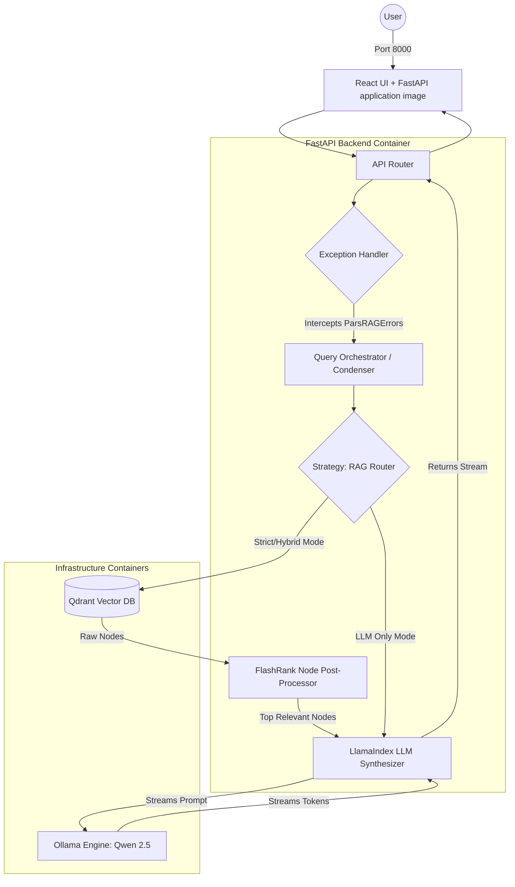

# Architecture Decision Records (ADR): System Architecture & Design Patterns

## 1. Definitive Technology Stack
To achieve FAANG-level production readiness, the initially proposed stack has been critically evaluated and upgraded. Below are the finalized technology decisions and their justifications:

- **Frontend UI: React 18, TypeScript, and Vite**
  - *Justification:* A dedicated React workspace provides precise control over bilingual RTL/LTR behavior, local state, accessibility, document management, and the branded interaction design. FastAPI serves the production build from `frontend/dist`.
- **Backend Framework: FastAPI** *(Retained)*
  - *Justification:* Asynchronous, high-performance web framework with native Pydantic validation and auto-generated OpenAPI docs. Ideal for serving LLMs and decoupling the backend from the UI.
- **RAG Orchestration: LlamaIndex** *(Upgraded from LangChain)*
  - *Justification:* While LangChain is a versatile general-purpose agent framework, LlamaIndex provides vastly superior primitives specifically for RAG. It offers native abstractions for advanced indexing, document node parsing, hierarchical chunking, and intelligent routing.
- **Vector Database: Qdrant** *(Upgraded from ChromaDB)*
  - *Justification:* ChromaDB is excellent for prototyping, but Qdrant is written in Rust, offering exponentially faster read/write speeds, better memory safety, and robust multi-tenant namespace filtering (crucial for isolating session-scoped vs. global documents).
- **Text Extraction: PyMuPDF** *(Retained)*
  - *Justification:* Proven to be the most accurate open-source library for preserving structural integrity and extracting Right-To-Left (RTL) languages like Persian from digital PDFs.
- **Embeddings: `intfloat/multilingual-e5-base`**
  - *Justification:* A proven multilingual embedding model that performs exceptionally well on Persian text semantics.
- **Chunking Strategy:**
  - *Justification:* Using LlamaIndex's `SentenceSplitter` (formerly `RecursiveCharacterTextSplitter`) tuned specifically for Persian prose (target size: 500-1000 characters, overlap: 150 characters) to maintain semantic context boundaries.
## 2. High-Level System Architecture (Microservices)
The system keeps application and infrastructure boundaries explicit under Docker Compose. FastAPI serves the immutable React build, while Qdrant and Ollama remain replaceable infrastructure adapters.

### Containerization Strategy
1. **`app` Container:** A multi-stage image builds React with Vite, then serves the static workspace and typed API from FastAPI on port 8000.
2. **`qdrant` Container:** Runs the official Qdrant image with a private persistent volume.
3. **`ollama` Container:** Runs the local model service with a private persistent volume; an optional one-shot service pulls the configured model.

### Architecture Flow Diagram

## 3. Object-Oriented Design (OOP) & GoF Patterns
To ensure extreme maintainability and adherence to the Open-Closed Principle (OCP), the backend core is built using strict Abstract Base Classes (ABCs) and Gang of Four (GoF) design patterns.

### 3.1. Strategy Pattern (Routing the 3 Modes)
- **Problem:** Handling Strict RAG, LLM-Only, and Hybrid RAG requires branching logic that can easily bloat into massive `if/else` chains.
- **Solution:** Define an `AbstractQueryStrategy`. Create three concrete implementations: `StrictRAGStrategy`, `HybridRAGStrategy`, and `LLMOnlyStrategy`. The router dynamically instantiates the correct strategy at runtime based on the user's request. Adding a new mode (e.g., GraphRAG) only requires adding a new class.

### 3.2. Repository Pattern (Database Decoupling)
- **Problem:** Tying the application tightly to Qdrant makes it difficult to unit test or swap databases in the future.
- **Solution:** Implement a `AbstractDocumentRepository` interface. The `QdrantRepository` implements this interface handling `save_nodes()`, `delete_session()`, and `similarity_search()`. The rest of the application only interacts with the interface.

### 3.3. Singleton / Global Configuration Pattern
- **Problem:** Constructing LlamaIndex components (VectorStoreIndex, Retrievers, LLMs) across different strategies requires significant boilerplate and configuration injection.
- **Solution:** Utilize LlamaIndex's global `Settings` object (acting as a Singleton/Configuration registry) to inject the chosen LLM and embedding model uniformly at startup, avoiding the need for a complex custom Factory.

### 3.4. Dependency Injection (DI)
- **Problem:** Hardcoding dependencies makes testing impossible.
- **Solution:** Utilize FastAPI's native `Depends()` to inject the `DocumentRepository` and the selected `QueryStrategy` directly into the route handlers.

## 4. Data Models (Domain Layer)
All data crossing system boundaries is strictly validated using Pydantic V2 models.

- **`ChatMessage`**: Represents a single conversation turn (role and content), acting as the backbone for conversational memory.
- **`DocumentIngestionRequest`**: Contains `file_bytes`, `filename`, and `session_id` (optional).
- **`QueryRequest`**: Contains `prompt` (str), `chat_history` (list of messages), and `mode` (enum: strict, hybrid, llm-only).
- **`ExtractedNode`**: Represents a chunked piece of text. Contains `text`, `metadata` (page number, source file), and `relevance_score`.
- **`QueryResponse`**: Contains the final `answer` (str) and a list of `source_nodes` (list of `ExtractedNode`) to provide citations to the user.
