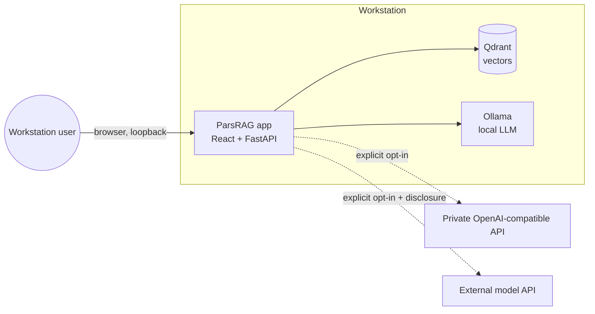
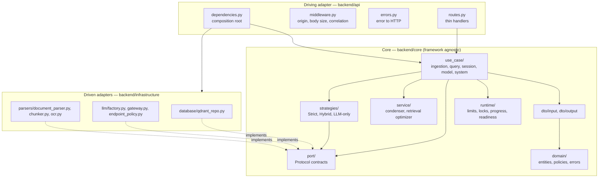

# ParsRAG Architecture

This document explains how ParsRAG is assembled: the runtime topology, the
layered backend, how the layers connect, and the main data flows. It is the
entry point for contributors; decisions and their rationale live in the
[Architecture Decision Records](.context/) and data handling is described in
[DATA.md](DATA.md).

- [1. System context](#1-system-context)
- [2. Runtime topology](#2-runtime-topology)
- [3. Backend layers](#3-backend-layers)
- [4. How the layers connect](#4-how-the-layers-connect)
- [5. Main flows](#5-main-flows)
- [6. Cross-cutting concerns](#6-cross-cutting-concerns)
- [7. Frontend](#7-frontend)
- [8. Extending ParsRAG](#8-extending-parsrag)
- [Blueprints](#blueprints)

## 1. System context

ParsRAG is a single-user, offline-first workspace for asking cited questions
about Persian and English documents. One person uses it on a workstation; the
trust boundary is the machine, with an optional, disclosed model endpoint.

Parsing, OCR, embeddings, and vector storage never leave the workstation.
Only generation may use a remote endpoint, and only after the user selects it.
See [ADR 07](.context/07_Runtime_Trust_and_Data_Boundaries.md).

## 2. Runtime topology

| Container | Image | Role | Persistence |
| --- | --- | --- | --- |
| `app` | Multi-stage build from `Dockerfile` | Serves the React build and the FastAPI API on port 8000 | Model settings and embedding cache volumes |
| `qdrant` | `qdrant/qdrant` | Vector store with session-scoped payload filters | Private named volume |
| `ollama` | `ollama/ollama` | Local generation (optional when an API model is used) | Model weights volume |

Compose overlays add NVIDIA (`compose.gpu.yaml`, `compose.gpu-low-vram.yaml`)
and Linux AMD (`compose.amd.yaml`) acceleration. The port binds to loopback by
default; LAN exposure requires an explicit host and origin configuration.

Startup is non-blocking: the API answers `/health/live` immediately, while a
background thread loads the embedding model, connects to Qdrant, and flips
`/health/ready` from `preparing` to `ready` (or `failed`).

## 3. Backend layers

The backend follows a ports-and-adapters (hexagonal) layout. Dependencies
point inward: adapters depend on the core; the core depends on nothing outside
itself except Pydantic and LlamaIndex primitives. The rules are recorded in
[ADR 08](.context/08_Ports_Use_Cases_and_DTOs.md).

| Layer | Package | Contains | Must not import |
| --- | --- | --- | --- |
| Domain | `core/domain` | `ExtractedNode`, `ParsedSection`, `QueryMode`, `ModelProvider`, session ID rules, `UploadPolicy`, error hierarchy | anything outside stdlib and Pydantic |
| DTOs | `core/dto/input`, `core/dto/output` | Validated requests/commands and responses | adapters, frameworks |
| Ports | `core/port` | `DocumentRepository`, `QueryStrategy`, `DocumentParser`, `TextChunker`, `QuestionCondenser`, `ModelGateway`, `ProgressTracker` | adapters |
| Use cases | `core/use_case/<module>` | One class per operation with an `execute` method | FastAPI, Starlette, Qdrant, httpx, PyMuPDF |
| Strategies and services | `core/strategies`, `core/service` | Answer pipelines, question condensation, retrieval depth | adapters |
| Runtime | `core/runtime` | `WorkLimiter`, `SessionLocks`, readiness, progress store, correlation ID | frameworks |
| Driven adapters | `infrastructure` | Qdrant, model factory and gateway, parsers, OCR | `api` |
| Driving adapter | `api`, `main.py` | Routes, middleware, error mapping, composition root | — |

## 4. How the layers connect

1. **Composition root.** `backend/api/dependencies.py` is the only module that
   knows both ports and adapters. It builds each use case per request and
   hands it to the route through FastAPI `Depends`. Tests override any
   provider (for example `get_document_repository`) instead of patching code.
2. **Ports.** Use cases and strategies receive collaborators typed as ports.
   `QdrantRepository`, `LocalDocumentParser`, `SentenceWindowChunker`,
   `CondenseQuestionPipeline`, `LlamaIndexModelGateway`, and
   `InMemoryQueryProgress` satisfy them structurally; mypy checks conformance at
   the wiring site.
3. **Errors.** Use cases raise `ApplicationError` subclasses. `api/errors.py`
   maps them to one status each: invalid input 400, not found 404, conflict
   409, payload too large 413, capacity 429, upstream 502. Infrastructure
   failures (`ParsRAGError`) become a generic 500 without internal detail;
   `EmptyDocumentError` becomes 400.
4. **Patterns.** Strategy (query modes), Repository (vector store), Factory
   (model clients), Adapter (ports), and a global configuration registry
   (LlamaIndex `Settings`). A Builder was evaluated and deferred — see ADR 08.

## 5. Main flows

Detailed sequence diagrams for every flow are in the
[data-flow blueprint](docs/architecture/data-flow.md). In short:

| Flow | Entry | Use case | Ports used |
| --- | --- | --- | --- |
| Upload documents | `POST /ingest` | `IngestDocuments` | `DocumentParser`, `TextChunker`, `DocumentRepository` |
| Ask a question (streamed) | `POST /query/stream` (SSE) | `AnswerQuery.stream` | `QuestionCondenser`, `QueryStrategy`, `DocumentRepository`, `ProgressTracker` |
| Ask a question | `POST /query` | `AnswerQuery` | `QuestionCondenser`, `QueryStrategy`, `DocumentRepository`, `ProgressTracker` |
| Follow progress | `GET /queries/{id}/progress` | `ReadQueryProgress` | `ProgressTracker` |
| Reuse a document | `POST /sessions/{id}/files/reuse` | `ReuseDocument` | `DocumentRepository` |
| List or delete documents | `GET`/`DELETE /sessions/{id}...` | `ListSessionFiles`, `DeleteDocument`, `DeleteSession` | `DocumentRepository` |
| Configure the model | `GET`/`PUT /models/configuration`, `GET /models/ollama` | `ReadModelConfiguration`, `ConfigureModel`, `ListOllamaModels` | `ModelGateway` |
| Title a conversation | `POST /conversations/title` | `GenerateConversationTitle` | `ModelGateway` |
| Health and capabilities | `/health/*`, `/capabilities` | `CheckReadiness`, `DescribeCapabilities` | `DocumentRepository` |

## 6. Cross-cutting concerns

| Concern | Where | Behavior |
| --- | --- | --- |
| Browser trust | `api/middleware.py` | Rejects state-changing and model-settings requests from untrusted origins |
| Body limits | `api/middleware.py`, `IngestDocuments` | Rejects oversized bodies before parsing and enforces per-file and per-batch budgets while reading |
| Capacity | `core/runtime/capacity.py` | Non-blocking slots for ingestion (default 1) and model work (default 2); overload returns 429 |
| Session isolation | `core/runtime/session_locks.py`, Qdrant filters | Striped locks serialize mutations per session; every query filters on `session_id` |
| Traceability | `core/runtime/correlation.py` | A per-request correlation ID appears in logs and the `x-correlation-id` header; prompts and documents are never logged |
| Secrets | `infrastructure/llm/factory.py` | API keys stay in process memory or environment; never persisted, logged, or returned |
| Endpoint safety | `infrastructure/llm/endpoint_policy.py` | Blocks link-local, multicast, and reserved targets; public endpoints require HTTPS |

## 7. Frontend

The React and TypeScript workspace in `frontend/` is built by Vite and served
by FastAPI from `frontend/dist`. It keeps conversations, branches, and answer
sources in IndexedDB (preferences in `localStorage`), discovers upload limits
from `/capabilities`,
reads answers from `/query/stream` as they are generated (stages, numbered
sources, text, then the final result with cited source numbers), and registers a service
worker that caches only the application shell — API traffic always goes to the
network. See [ADR 06](.context/06_Conversation_Workspace.md),
[ADR 07 (PWA)](.context/07_PWA_Offline_Shell.md), and
[frontend/BRAND.md](frontend/BRAND.md).

## 8. Extending ParsRAG

| To add | Do this |
| --- | --- |
| A query mode | Implement `QueryStrategy` in `core/strategies/`, add the enum value to `QueryMode`, and select it in `get_query_strategy` |
| A vector store | Implement `DocumentRepository` in `infrastructure/database/` and return it from `_shared_document_repository` |
| A document format | Extend `UploadPolicy` extensions, `validate_upload` signatures, and the local parser adapter |
| A model provider | Extend the factory and `ModelGateway` adapter; keep endpoint validation and disclosure rules |
| An endpoint | Add DTOs, a use case under `core/use_case/<module>/`, a provider in `dependencies.py`, and a thin route |

Every change needs unit tests for the use case (with the in-memory fakes in
`backend/tests/core/use_case/fakes.py`) and an API test for the HTTP contract.

## Blueprints

- [Data flow](docs/architecture/data-flow.md) — layer-by-layer sequences for ingestion and querying
- [Use cases](docs/architecture/use-cases.md) — every use case with its rules, ports, and errors
- [DTOs](docs/architecture/dtos.md) — inbound and outbound contracts and where they cross layers
