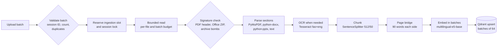
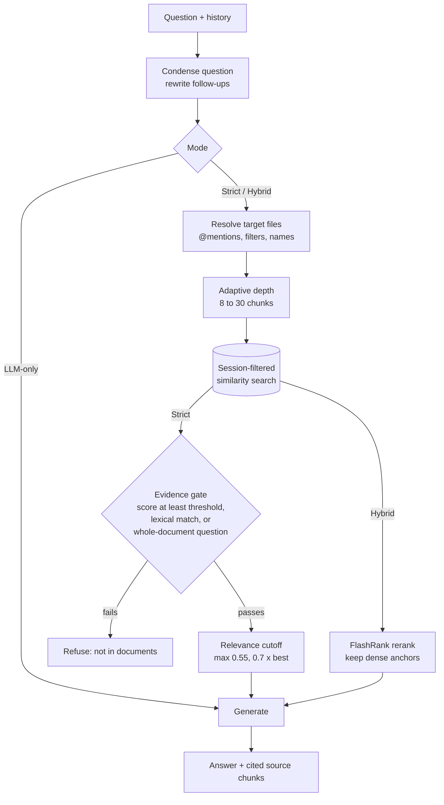

# ParsRAG Data Guide

How documents become searchable evidence, how answers are grounded, where every
piece of data lives, and why Qdrant was chosen. Architecture and layering are
covered in [ARCHITECTURE.md](ARCHITECTURE.md); trust boundaries in
[ADR 07](.context/07_Runtime_Trust_and_Data_Boundaries.md).

- [1. Data inventory](#1-data-inventory)
- [2. Ingestion pipeline (ETL)](#2-ingestion-pipeline-etl)
- [3. Vector storage model](#3-vector-storage-model)
- [4. Retrieval-augmented generation](#4-retrieval-augmented-generation)
- [5. Why Qdrant](#5-why-qdrant)
- [6. Lifecycle, retention, and backup](#6-lifecycle-retention-and-backup)
- [7. Configuration reference](#7-configuration-reference)

## 1. Data inventory

| Data | Created by | Stored in | Leaves the workstation? |
| --- | --- | --- | --- |
| Uploaded file bytes | Browser upload | Process memory only, during ingestion | No — raw files are never written to disk or Qdrant |
| Parsed text chunks and metadata | `IngestDocuments` | Qdrant payload (`text`, `filename`, location fields, `session_id`) | No |
| Embedding vectors | Local `multilingual-e5-base` | Qdrant vectors | No |
| Conversations, branches, preferences | Frontend | Browser `localStorage` | No |
| Non-secret model settings | `ConfigureModel` | `app_config` volume (JSON) | No |
| API key | Environment or settings form | Process memory | Only to the configured model endpoint, as a credential |
| Prompt and retrieved excerpts | `AnswerQuery` | Not persisted by the backend | Only when an API model is selected (disclosed in the UI) |
| Logs | Request middleware | Container stdout | No; method, path, status, duration, and correlation ID only |

## 2. Ingestion pipeline (ETL)

**Extract.**
- The `IngestDocuments` use case validates the whole batch first: the session
  ID, at most 10 files, no duplicate names, and no names already in the session.
- It then reads each file in 1 MiB chunks, stopping at 100 MiB per file and
  500 MiB per batch.
- Content must match its extension: PDFs start with `%PDF-`; DOCX/PPTX are ZIP
  archives with the expected parts, at most 10,000 entries, at most 200 MiB
  expanded, and at most a 200:1 compression ratio per entry.
- The local parser extracts sections with location metadata:

| Format | Section unit | Metadata |
| --- | --- | --- |
| PDF | Page | `page` |
| DOCX | Paragraph (with embedded-image OCR) or table | `paragraph` or `section` |
| PPTX | Slide, including tables | `slide` |
| Images | Whole image (OCR) | `page` = 1 |
| Text, Markdown, JSON, CSV, HTML/XML, YAML, config, logs, code | Whole file or normalized blocks | `section` |

OCR (Tesseract, `fas+eng`) runs only when native text is missing or sparse: for
scanned PDF pages, standalone images, and images embedded in DOCX/PPTX. It is
bounded by page count, image count, pixel count, and a per-page timeout. A
document that yields no text raises `EmptyDocumentError` (HTTP 400).

**Transform.**
- Each section is split with LlamaIndex `SentenceSplitter` (chunk size 512
  tokens, overlap 50), and every chunk inherits the section metadata plus
  `filename`.
- For consecutive PDF pages, a bridge chunk joins the last 90 words of one page
  with the first 90 of the next, marked `[page N]`, and cites both pages
  (`page`, `page_end`, `kind: page_bridge`). This
  keeps a fact split by a page break retrievable.
- Embeddings use `intfloat/multilingual-e5-base` (768 dimensions) on CPU, CUDA,
  or MPS, in batches of 8 (32 on GPU).

**Load.** Chunks are saved section by section in upsert batches of 64. Memory
therefore stays bounded by one section, not the whole document. Each point gets
a random UUID.

**Reuse without re-ingestion.** `ReuseDocument` copies an indexed file's points
into another session in bounded pages. No upload, parse, OCR, or embedding is
repeated, and the copies are independent afterwards.

## 3. Vector storage model

| Aspect | Value |
| --- | --- |
| Collection | `parsrag_<first 12 hex of SHA-256(EMBED_MODEL_NAME)>`, or `QDRANT_COLLECTION` |
| Vector | Dense, cosine distance, size probed from the embedding model |
| Payload | `text`, `filename`, `session_id`, and location fields (`page`, `page_end`, `kind`, `slide`, `paragraph`, `section`) |
| Payload indexes | `session_id` (keyword), `filename` (keyword) |
| Isolation | Every search and listing filters by `session_id`; file filters add `filename` conditions |
| Pagination | File listing and document copy scroll through results instead of reading at most 1,000 points |

**Schema versioning.** The collection name is derived from the embedding model,
so switching models creates a new collection instead of mixing vector spaces.
On startup the stored vector size is compared with the active model, and a
mismatch fails readiness rather than corrupting search. After a model change,
documents must be uploaded again; old collections can be backed up and removed.

## 4. Retrieval-augmented generation

**Conversational memory.** When history exists, `CondenseQuestionPipeline` asks
the active model to rewrite the follow-up as a standalone question in the same
language, preserving code and identifiers. Retrieval then uses the rewritten
question.

**Targeting.** Explicit `@{file}` mentions split the question into per-file
segments, each retrieved from its own document. Otherwise an explicit file
filter or filenames named in the question narrow the search. Broad questions
spread retrieval across files so one large document cannot crowd out the rest.

**Depth.** `RetrievalOptimizer` adapts the number of chunks (8–30, base 12) to
the question type: summaries, comparisons, enumerations, and tables get more
context, factoid questions less. Precedence: a request's `top_k`, then an
operator's fixed depth (`STRICT_RAG_TOP_K` / `HYBRID_RERANK_TOP_K`), then the
adaptive depth.

| Mode | Retrieval | Gate | Context sent to the model |
| --- | --- | --- | --- |
| Strict | Similarity search | Best score at least `STRICT_RAG_THRESHOLD` (default 0.75), or at least `max(0.55, threshold − 0.20)` with the question's distinctive terms present (Persian and Latin digits match), or a whole-document question (topic, type, summary); every mentioned file needs its own evidence | Chunks scoring at least `max(0.55, 0.7 × best)`, grouped by document with location tags |
| Hybrid | Wider candidate pool (at least `HYBRID_RETRIEVE_TOP_K`, 25) | None; reranked with FlashRank | Reranked chunks plus at least 3 dense anchors, or one per mentioned file |
| LLM-only | None | None | Question and history only |

The gate only filters clearly unrelated material: on the private evaluation
set, top similarity scores of relevant and off-topic questions overlap
(medians 0.806 and 0.807 for whole-document and off-topic questions), so the
decision is left to the model, which sees the excerpts. Strict mode's prompt
forbids outside knowledge but allows answering by meaning rather than exact
wording, combining excerpts, conclusions that follow directly from them, and
partial answers that name what the documents do not cover. It refuses only
when nothing in the context is relevant.

## 5. Why Qdrant

| Requirement | Qdrant | Alternatives considered |
| --- | --- | --- |
| Local, offline, single container | Official image, no external services | ChromaDB (embedded, simpler, weaker filtering at scale) |
| Strict per-session isolation | Indexed keyword payload filters applied inside the vector search | FAISS (no payload filtering or persistence by itself) |
| Bounded memory on workstations | Rust engine, on-disk storage, predictable footprint | pgvector (needs a PostgreSQL deployment and tuning) |
| Deletion that actually removes data | Filtered point deletion by `session_id` / `filename` | Index rebuilds in library-only stores |
| Paging large sessions | Native scroll API | Manual offset handling |
| Swappability | Hidden behind the `DocumentRepository` port | — |

A relational database is not needed: the application has no multi-user
records, and conversations intentionally stay in the browser. The decision is
recorded in [ADR 02](.context/02_Architecture_and_Patterns.md).

## 6. Lifecycle, retention, and backup

| Action | Effect |
| --- | --- |
| Delete one document | Removes its points from that session only |
| Delete a conversation | Deletes the session's points, then the browser record |
| Clear all data | Deletes every known session in Qdrant before clearing browser storage, and reports partial failures |
| Change embedding model | New collection; re-upload documents |

There is no automatic expiry. For a full backup, snapshot the `qdrant_data`
volume and export browser storage together, because conversations reference
session IDs stored in Qdrant. Removing the volume securely deletes all vectors
and chunk text.

## 7. Configuration reference

| Variable | Default | Effect |
| --- | --- | --- |
| `EMBED_MODEL_NAME` | `intfloat/multilingual-e5-base` | Embedding model; also versions the collection name |
| `EMBED_DEVICE` | `auto` | `auto`, `cpu`, `cuda`, or `mps` |
| `EMBED_BATCH_SIZE` | `8` (`32` on CUDA) | Embedding batch, 1–128 |
| `QDRANT_HOST` / `QDRANT_PORT` | `localhost` / `6333` | Vector store address |
| `QDRANT_COLLECTION` | derived | Explicit collection override |
| `QDRANT_UPSERT_BATCH_SIZE` | `64` | Upsert batch, 1–512 |
| `STRICT_RAG_THRESHOLD` | `0.75` | Strict mode evidence gate |
| `STRICT_RAG_TOP_K` (alias `RAG_TOP_K`) | empty | Fixed Strict retrieval depth (1–50); empty uses adaptive depth |
| `HYBRID_RERANK_TOP_K` | empty | Fixed Hybrid reranked chunk count (1–50); empty uses adaptive depth |
| `HYBRID_RETRIEVE_TOP_K` | `25` | Minimum Hybrid candidate pool |
| `PARSRAG_MAX_FILES_PER_SESSION` | `10` | Documents per conversation |
| `PARSRAG_MAX_FILE_BYTES` / `PARSRAG_MAX_BATCH_BYTES` | 100 MiB / 500 MiB | Upload budgets |
| `OCR_ENABLED`, `OCR_LANGUAGES`, `OCR_MAX_PAGES`, `OCR_MAX_IMAGES`, `OCR_MAX_IMAGE_PIXELS`, `OCR_TIMEOUT_SECONDS` | see README | OCR bounds |
