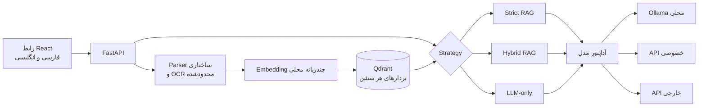

<p align="left"><strong>فارسی</strong> · <a href="README.md">English</a></p>

<p align="center">
  
</p>

<h1 align="center">پارس‌رگ</h1>

<p align="center">
  <strong>دستیار خصوصی اسناد، طراحی‌شده برای زبان فارسی</strong><br>
  گفت‌وگوی دقیق و قابل‌ردیابی با فایل‌های فارسی و انگلیسی
</p>

<p align="center">
  <a href="LICENSE"></a>
  
  
  
</p>

پارس‌رگ یک فضای کاری دوزبانه و آفلاین‌محور برای پرسش و پاسخ روی اسناد است.
استخراج متن، OCR، embedding و جست‌وجوی برداری روی سیستم میزبان انجام می‌شوند.
برای تولید پاسخ می‌توان از Ollama محلی، یک API سازگار با OpenAI در شبکه خصوصی
یا یک سرویس خارجی استفاده کرد. هر گفت‌وگو اسناد، محدوده جست‌وجو، شاخه‌های
پاسخ، منابع و چرخه حذف مستقل خود را دارد.

## قابلیت‌های اصلی

- **سه روش پاسخ‌دهی روشن:** فقط مبتنی بر سند، ترکیبی و فقط مبتنی بر دانش مدل.
- **ورودی‌های متنوع:** PDF، Word، PowerPoint، تصویر، متن، Markdown، JSON، CSV،
  HTML، XML، YAML، فایل‌های لاگ، تنظیمات و فرمت‌های رایج کد.
- **OCR هدفمند:** صفحات تصویری PDF، تصاویر مستقل و تصاویر داخل DOCX و PPTX با
  داده‌های فارسی و انگلیسی Tesseract.
- **منابع قابل‌ردیابی:** نام یکتای فایل همراه با صفحه، اسلاید، پاراگراف یا بخش،
  هرجا که ساختار فایل اجازه دهد.
- **مدیریت داده محلی:** جداسازی داده هر گفت‌وگو در Qdrant، حذف یک سند، برداشتن
  انتخاب همه اسناد و حذف کامل سشن.
- **استفاده تطبیقی از سخت‌افزار:** CPU حالت قابل‌حمل پیش‌فرض است و پروفایل‌های
  جداگانه Docker، embedding و Ollama را روی NVIDIA یا AMD سازگار اجرا می‌کنند.
- **کنترل مصرف منابع:** محدودیت برای آپلود، ابعاد تصویر OCR، آرشیو Office،
  هم‌زمانی، batchهای embedding و Qdrant و حافظه کانتینرها.
- **رابط حرفه‌ای فارسی و انگلیسی:** جهت مستقل محتوای پاسخ، تنظیم مدل، نمایش
  مرحله‌های واقعی پردازش، نمایش تدریجی پاسخ، فرمول‌های ریاضی، ویرایش پرامپت،
  تولید دوباره پاسخ و شاخه‌بندی مکالمه.

## حالت‌های پاسخ‌دهی

| حالت | بازیابی سند | دانش مدل | کاربرد |
| --- | --- | --- | --- |
| **فقط سند (Strict)** | الزامی | طبق قرارداد پرامپت استفاده نمی‌شود | پاسخ‌هایی که باید فقط به اسناد انتخاب‌شده متکی باشند |
| **ترکیبی (Hybrid)** | الزامی و همراه با rerank | می‌تواند شواهد را تکمیل کند | توضیح و جمع‌بندی با اولویت سند |
| **فقط مدل (LLM-only)** | انجام نمی‌شود | مستقیماً استفاده می‌شود | گفت‌وگوی عمومی و مستقل از اسناد |

حالت Strict وقتی شواهد بازیابی‌شده به حدنصاب نرسند از پاسخ قطعی خودداری می‌کند.
این رفتار یک محافظ نرم‌افزاری است؛ پاسخ‌های مهم را با منابع نمایش‌داده‌شده تطبیق
دهید.

## فرمت‌های پشتیبانی‌شده

| خانواده | پسوندها | روش پردازش |
| --- | --- | --- |
| سند | `.pdf`، `.docx`، `.pptx` | استخراج ساختاری؛ OCR برای صفحات تصویری PDF و تصاویر داخل Office |
| تصویر | `.png`، `.jpg`، `.jpeg`، `.webp`، `.bmp`، `.tif`، `.tiff` | اعتبارسنجی و OCR |
| متن و داده | `.txt`، `.md`، `.markdown`، `.json`، `.csv`، `.tsv`، `.log` | استخراج UTF-8؛ اعتبارسنجی و نرمال‌سازی JSON |
| نشانه‌گذاری و تنظیمات | `.html`، `.htm`، `.xml`، `.yaml`، `.yml`، `.toml`، `.ini`، `.cfg` | متن قابل‌مشاهده یا UTF-8 |
| کد منبع | `.py`، `.js`، `.jsx`، `.ts`، `.tsx`، `.css`، `.sql` | استخراج UTF-8 با متادیتای بخش |

ظرفیت پیش‌فرض **۱۰ فایل در هر سشن**، **۱۰۰ مگابایت دودویی برای هر فایل** و
**۵۰۰ مگابایت دودویی در هر batch آپلود** است. فرانت‌اند محدودیت‌های واقعی را
از بک‌اند دریافت می‌کند؛ در نتیجه تغییر `.env` هم‌زمان در اعتبارسنجی و رابط
کاربر اعمال می‌شود. فایل‌های Office از نظر تعداد ورودی‌های آرشیو، حجم بازشده و
نسبت فشرده‌سازی مشکوک نیز بررسی می‌شوند.

## معماری و مرز اعتماد



| فراهم‌کننده | محل تولید پاسخ | داده‌ای که از پارس‌رگ خارج می‌شود |
| --- | --- | --- |
| Ollama محلی | همین سیستم | پرامپت یا متن بازیابی‌شده از آداپتور مدل خارج نمی‌شود |
| API خصوصی | سرور تحت کنترل شما | پرامپت و بخش‌های بازیابی‌شده در حالت‌های RAG |
| API خارجی | سرویس شخص ثالث | پرامپت و بخش‌های بازیابی‌شده در حالت‌های RAG |

Embedding و Qdrant در همه حالت‌ها محلی می‌مانند. کلید API فقط در حافظه پردازش
یا متغیر محیطی نگه‌داری می‌شود و در localStorage، لاگ، پاسخ API یا فایل تنظیمات
پایدار مدل ذخیره نمی‌شود.

## اجرای سریع با Docker

پیش‌نیازها: Docker Engine و Compose، فضای کافی برای imageها و مدل‌ها و بسته به
مدل انتخابی حدود ۸ تا ۱۶ گیگابایت RAM.

```powershell
Copy-Item .env.example .env
docker compose config --quiet
```

### استفاده از API مدل

مقادیر زیر را در `.env` تنظیم کنید:

```dotenv
LLM_PROVIDER=api
LLM_MODEL_NAME=your-model-id
MODEL_API_BASE_URL=https://provider.example/v1
MODEL_API_KEY=your-runtime-secret
MODEL_API_DISCLOSURE_ACKNOWLEDGED=1
```

API خصوصی سازگار با OpenAI می‌تواند بدون کلید باشد. آدرس‌های عمومی باید HTTPS
باشند، اما loopback و شبکه خصوصی می‌توانند از HTTP استفاده کنند.
برای API خارجی، فقط پس از پذیرش ارسال پرسش‌ها و بخش‌های مرتبط اسناد، مقدار
`MODEL_API_DISCLOSURE_ACKNOWLEDGED` را `1` بگذارید. در تنظیمات برنامه نیز همین
تأیید هنگام انتخاب API ثبت می‌شود.

```powershell
docker compose up -d --build
```

### اجرای Ollama روی CPU

مدلی متناسب با RAM سیستم انتخاب کنید:

```dotenv
LLM_PROVIDER=ollama
LLM_MODEL_NAME=qwen2.5:7b
OLLAMA_MODEL=qwen2.5:7b
```

```powershell
docker compose --profile local-model up -d qdrant ollama
docker compose --profile local-model run --rm ollama-init
docker compose --profile local-model up -d --build app
```

مدل فقط یک‌بار در volume به نام `ollama_models` دانلود می‌شود. اجرای CPU روی
همه سیستم‌ها ممکن است اما برای مدل‌های بزرگ کند است؛ در سیستم ضعیف از مدل
quantized کوچک‌تر یا API استفاده کنید.

### اجرای Ollama و embedding روی NVIDIA GPU

در میزبان Docker باید درایور به‌روز NVIDIA و پشتیبانی NVIDIA Container Toolkit
فعال باشد. overlay زیر را در همه فرمان‌های مرتبط وارد کنید:

```powershell
docker compose -f compose.yaml -f compose.gpu.yaml --profile local-model config --quiet
docker compose -f compose.yaml -f compose.gpu.yaml --profile local-model up -d qdrant ollama
docker compose -f compose.yaml -f compose.gpu.yaml --profile local-model run --rm ollama-init
docker compose -f compose.yaml -f compose.gpu.yaml --profile local-model up -d --build app
```

سپس هر دو مسیر شتاب‌دهی را بررسی کنید:

```powershell
docker compose -f compose.yaml -f compose.gpu.yaml exec app python -c "import torch; print(torch.cuda.is_available(), torch.cuda.get_device_name(0))"
docker compose -f compose.yaml -f compose.gpu.yaml exec ollama ollama run qwen2.5:7b "Reply with exactly GPU_OK"
docker compose -f compose.yaml -f compose.gpu.yaml exec ollama ollama ps
```

کارت‌هایی با حدود ۶ گیگابایت VRAM ممکن است نتوانند مدل embedding و مدل مولد 7B
را هم‌زمان به‌طور کامل در حافظه نگه دارند. اگر `ollama ps` ترکیب CPU/GPU را
نشان داد، با overlay کم‌حافظه، تولید پاسخ را در اولویت GPU قرار دهید و embedding
را روی CPU نگه دارید:

```powershell
docker compose -f compose.yaml -f compose.gpu.yaml -f compose.gpu-low-vram.yaml --profile local-model up -d app ollama
docker compose -f compose.yaml -f compose.gpu.yaml -f compose.gpu-low-vram.yaml exec ollama ollama ps
```

این overlay مقدار پیش‌فرض context را نیز به ۲۰۴۸ token کاهش می‌دهد. فقط زمانی
`OLLAMA_LOW_VRAM_CONTEXT_LENGTH` را بیشتر کنید که مدل و VRAM بدون offload ظرفیت
آن را داشته باشند. این overlay حاشیه آزاد VRAM را صفر می‌کند؛ اگر محیط دسکتاپ
به حافظه رزروشده نیاز دارد، overlay را بردارید یا
`OLLAMA_LOW_VRAM_FIT_TARGET` را افزایش دهید.

image برنامه از wheel رسمی PyTorch CUDA 12.4 استفاده می‌کند و Compose کارت
NVIDIA را برای هر دو سرویس `app` و `ollama` رزرو می‌کند. برای آماده‌سازی میزبان
به [راهنمای GPU در Docker Compose](https://docs.docker.com/compose/how-tos/gpu-support/)،
[راهنمای Docker در Ollama](https://github.com/ollama/ollama/blob/main/docs/docker.mdx)
و [راهنمای GPU در Ollama](https://github.com/ollama/ollama/blob/main/docs/gpu.mdx)
مراجعه کنید.

### اجرای AMD در میزبان‌های پشتیبانی‌شده

overlay مربوط به AMD برای Linux و ROCm طراحی شده و `/dev/kfd` و `/dev/dri` را
در اختیار کانتینرها می‌گذارد:

```bash
docker compose -f compose.yaml -f compose.amd.yaml --profile local-model config --quiet
docker compose -f compose.yaml -f compose.amd.yaml --profile local-model up -d --build
```

این حالت از image مخصوص ROCm در Ollama و wheelهای PyTorch ROCm 6.2 استفاده
می‌کند. سازگاری کارت و درایور را پیش از استقرار بررسی کنید؛ برای سخت‌افزار
پشتیبانی‌نشده از پروفایل CPU یا API مدل استفاده کنید.

برنامه در `http://127.0.0.1:8000` یا پورت `PARSRAG_PORT` در دسترس است.

```powershell
docker compose ps
docker compose logs -f app
docker compose down
```

فرمان `docker compose down` داده volumeها را نگه می‌دارد. اجرای
`docker compose down -v` داده Qdrant، تنظیمات مدل، cache و وزن‌های Ollama را
حذف می‌کند.

## تنظیم کارایی و حافظه

| متغیر | پیش‌فرض | کاربرد |
| --- | --- | --- |
| `PARSRAG_APP_MEMORY_LIMIT` | `6g` | سقف حافظه کانتینر برنامه |
| `QDRANT_MEMORY_LIMIT` | `2g` | سقف حافظه Qdrant |
| `OLLAMA_MEMORY_LIMIT` | `12g` | سقف حافظه Ollama |
| `PARSRAG_CPU_THREADS` | `4` | تعداد threadهای CPU برای PyTorch/OpenMP |
| `EMBED_DEVICE` | `auto` | دستگاه embedding؛ overlay انویدیا آن را `cuda` می‌کند |
| `EMBED_BATCH_SIZE` | `8` | batch embedding؛ در GPU مقدار پیش‌فرض `32` است |
| `QDRANT_UPSERT_BATCH_SIZE` | `64` | اندازه batch محدودشده برای ثبت بردارها |
| `OLLAMA_MAX_LOADED_MODELS` | `1` | تعداد مدل‌های هم‌زمان در حافظه |
| `OLLAMA_NUM_PARALLEL` | `1` | تعداد generationهای هم‌زمان Ollama |
| `OLLAMA_KEEP_ALIVE` | `5m` | مدت نگه‌داشتن وزن مدل در حافظه |
| `OLLAMA_CONTEXT_LENGTH` | `4096` | context مدل؛ overlay کم‌حافظه مقدار `2048` دارد |

برای سیستم‌های کم‌حافظه batch و concurrency را کاهش دهید. محدودیت حافظه
کانتینر سقف مصرف است؛ مدل محلی همچنان باید در RAM یا VRAM موجود جا شود.

## تنظیمات آپلود و OCR

| متغیر | پیش‌فرض | کاربرد |
| --- | --- | --- |
| `PARSRAG_MAX_FILES_PER_SESSION` | `10` | کل اسناد یک گفت‌وگو |
| `PARSRAG_MAX_FILE_BYTES` | `104857600` | ۱۰۰ MiB برای هر فایل |
| `PARSRAG_MAX_BATCH_BYTES` | `524288000` | ۵۰۰ MiB برای هر batch |
| `PARSRAG_MAX_REQUEST_BYTES` | `534773760` | سقف body شامل سربار multipart |
| `OCR_ENABLED` | `1` | فعال‌سازی مسیرهای Tesseract |
| `OCR_LANGUAGES` | `fas+eng` | زبان‌های OCR |
| `OCR_MAX_PAGES` | `30` | سقف صفحات تصویری PDF |
| `OCR_MAX_IMAGES` | `30` | سقف تصاویر مستقیم یا داخل Office |
| `OCR_MAX_IMAGE_PIXELS` | `40000000` | محافظ ابعاد بازشده تصویر |
| `OCR_TIMEOUT_SECONDS` | `45` | timeout هر صفحه یا تصویر |

## توسعه مستقیم روی ویندوز

به Python 3.12، Node.js 22، Qdrant و Ollama یا یک endpoint سازگار با OpenAI
نیاز دارید. برای OCR نیز Tesseract همراه با زبان‌های `fas` و `eng` لازم است.

```powershell
py -3.12 -m venv .venv
.\.venv\Scripts\python.exe -m pip install -r requirements-runtime.txt -c requirements.lock

Set-Location frontend
npm ci
npm run build
Set-Location ..

.\.venv\Scripts\python.exe -m uvicorn backend.main:app --host 127.0.0.1 --port 8000
```

برای hot reload در پوشه `frontend` فرمان `npm run dev` را اجرا کنید. Vite تمام
خانواده‌ مسیرهای API را به `http://localhost:8000` proxy می‌کند. فقط برای توسعه
محلی و در صورت نیاز، `ENVIRONMENT=development` را در `.env` قرار دهید.

## سلامت سرویس، ماندگاری و اجرای آفلاین

- `/health/live` زنده بودن فرایند وب را اعلام می‌کند.
- `/health/ready` پس از آماده‌شدن مدل و Qdrant کد `200` می‌دهد؛ هنگام دانلود یا
  آماده‌سازی اولیه، پاسخ `503 {"status":"preparing"}` طبیعی است.
- `/capabilities` فرمت‌ها و محدودیت‌های مؤثر آپلود را به رابط اعلام می‌کند.
- تنظیمات رابط و شاخه‌های مکالمه در `localStorage` مرورگر ذخیره می‌شوند.
- متن‌های chunkشده و بردارها با شناسه سشن در Qdrant قرار می‌گیرند.
- cache مدل embedding، داده Qdrant، مدل‌های Ollama و تنظیمات غیرمحرمانه مدل در
  volumeهای جداگانه نگه‌داری می‌شوند.
- پس از دانلود اولیه imageها و وزن مدل، حالت Ollama محلی می‌تواند آفلاین بماند.

## کنترل‌های کیفیت

```powershell
.\.venv\Scripts\python.exe -m ruff format --check backend
.\.venv\Scripts\python.exe -m ruff check backend
.\.venv\Scripts\python.exe -m mypy backend --strict
.\.venv\Scripts\python.exe -m pytest -q backend/tests

Set-Location frontend
npm test
npm run build
npm run test:e2e
Set-Location ..

docker compose config --quiet
docker compose -f compose.yaml -f compose.gpu.yaml --profile local-model config --quiet
docker compose -f compose.yaml -f compose.gpu.yaml -f compose.gpu-low-vram.yaml --profile local-model config --quiet
docker compose -f compose.yaml -f compose.amd.yaml --profile local-model config --quiet
```

فایل‌های خصوصی تست باید در `testData/` و خروجی آزمایش‌های موقت در `scratch/`
بمانند. هر دو مسیر در Git نادیده گرفته می‌شوند و نباید کامیت شوند.

## اسناد پروژه

- [نسخه انگلیسی README](README.md)
- [هویت بصری و قواعد حرکت](frontend/BRAND.md)
- [نقشه راه پیاده‌سازی](.context/05_Implementation_Roadmap.md)
- [سیاست امنیت](SECURITY.md)
- [راهنمای مشارکت](CONTRIBUTING.md)
- [روش استناد به پارس‌رگ](CITATION.cff)
- [فهرست تغییرات](CHANGELOG.md)

## مجوز

پارس‌رگ یک نرم‌افزار **source-available است و متن‌باز محسوب نمی‌شود**.
[مجوز پارس‌رگ](LICENSE) دانلود و اجرای نسخه رسمی و تغییریافته‌نشده را برای
استفاده شخصی، دانشگاهی، پژوهشی، آموزشی و داخلی سازمان مجاز می‌کند. بازنشر،
تغییر برند، ارائه به‌عنوان سرویس و تغییر بدون اجازه ممنوع است. تغییرات فقط برای
ارسال Pull Request به همین مخزن و مطابق
[توافق مشارکت‌کنندگان](CONTRIBUTOR_LICENSE_AGREEMENT.md) قابل آماده‌سازی هستند.
برای هر استفاده دیگر باید از صاحب اثر اجازه کتبی گرفته شود.
