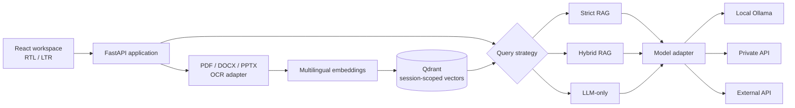

<p align="center">
  
</p>

<h1 align="center">ParsRAG</h1>

<p align="center">
  <strong>Private document intelligence, designed for Persian.</strong><br>
  گفت‌وگوی دقیق و مستند با فایل‌های فارسی و انگلیسی
</p>

<p align="center">
  <a href="LICENSE"></a>
  
  
  
</p>

ParsRAG is a single-user, offline-first workspace for asking questions across
Persian and English documents. Parsing, OCR, embeddings, and vector search stay
on the workstation. Generation can run locally with Ollama, on a private
OpenAI-compatible server, or through an external API when local hardware is not
available.

The interface is bilingual, responsive, RTL-aware, and built around sessions:
each conversation owns its documents, sources, model mode, and deletion
lifecycle.

## Why ParsRAG

- **Document Knowledge Only:** Strict RAG answers from retrieved evidence and
  refuses when the evidence threshold is not met.
- **Hybrid Reasoning:** multilingual dense retrieval is combined with reranking,
  while strong dense anchors protect Persian evidence from weak reranker scores.
- **Model Knowledge Only:** use the configured model as a regular assistant with
  no Qdrant lookup or document sources.
- **Real Persian PDF support:** native extraction preserves page metadata;
  image-only pages use bounded Tesseract OCR with `fas+eng` language data.
- **Useful citations:** answers return the source filename and available page,
  slide, paragraph, or section metadata without exposing raw retrieval payloads
  in the interface.
- **Local data control:** sessions are isolated in Qdrant, individual documents
  can be removed, and clear-all completes backend deletion before clearing the
  browser workspace.
- **Explicit model trust:** the settings UI distinguishes local Ollama, private
  network APIs, and external APIs before document context can leave the device.

## Three answer modes

| Mode | Document retrieval | Model knowledge | Best used for |
| --- | --- | --- | --- |
| **Strict** | Required | Forbidden by prompt contract | Policies, reports, research, and answers that must stay inside supplied documents |
| **Hybrid** | Required and reranked | May supplement retrieved evidence | Explanations and synthesis that benefit from broader reasoning |
| **LLM-only** | Bypassed | Used directly | General conversation and questions unrelated to uploaded documents |

For document-specific work, start with **Strict**. In the September 2026 PDF
evaluation it answered 14/14 factual questions and refused 7/7 unrelated
controls. LLM-only answered every request but matched only 3/7 private-document
references, which is exactly why the modes remain separate. The reproducible
runner lives under `backend/tests/evaluation`; private cases and run artifacts
remain in ignored local directories.

## Supported documents

| Format | Native extraction | Structure metadata | OCR fallback |
| --- | --- | --- | --- |
| PDF | PyMuPDF | Page | Yes, for image-only pages |
| DOCX | python-docx | Paragraph and table content | No |
| PPTX | python-pptx | Slide and table content | No |

Uploads are validated by extension and signature. The default limits are five
files per request, 50 MB per file, and 100 MB per batch. Office archives also
have entry-count, expanded-size, and compression-ratio protections.

## Architecture



The backend is a modular application with Strategy, Repository, and Factory
boundaries. Qdrant and model providers remain replaceable infrastructure
adapters; API routes do not contain vector-store logic.

## Choose the trust boundary

| Provider | Generation runs on | Data sent by ParsRAG |
| --- | --- | --- |
| Local Ollama | This workstation | Nothing through the model adapter |
| Private API | A server you control | Prompt and retrieved excerpts in RAG modes |
| External API | A third-party service | Prompt and retrieved excerpts in RAG modes |

Embeddings and Qdrant stay local in every mode. API keys are kept in process
memory or environment variables. They are never written to browser storage,
logs, API responses, or the persisted model configuration file.

## Quick start with Docker

Requirements:

- Docker Engine with Compose
- 16 GB system RAM recommended for comfortable local use
- enough disk space for images, the embedding cache, Qdrant, and optional model
  weights

Create the local configuration in PowerShell:

```powershell
Copy-Item .env.example .env
```

### API-backed model

Set these values in `.env`:

```dotenv
LLM_PROVIDER=api
LLM_MODEL_NAME=your-model-id
MODEL_API_BASE_URL=https://your-provider.example/v1
MODEL_API_KEY=your-runtime-secret
```

Private OpenAI-compatible services may use an empty key. Public endpoints must
use HTTPS; private and loopback addresses may use HTTP.

```powershell
docker compose up --build
```

### Local Ollama

Choose a model that fits the target machine before first start:

```dotenv
LLM_PROVIDER=ollama
OLLAMA_MODEL=gemma3:12b
LLM_MODEL_NAME=gemma3:12b
```

```powershell
docker compose --profile local-model up --build
```

The initializer downloads the selected Ollama model once into a named volume.
Large models commonly require several gigabytes and may be impractical on a
CPU-only workstation; those installations can use a private or external API
instead.

Open [http://127.0.0.1:8000](http://127.0.0.1:8000). Only the application port
is published. Qdrant and Ollama stay inside the Compose network.

```powershell
docker compose ps
docker compose logs -f app
docker compose down
```

`docker compose down` preserves data volumes. Use `docker compose down -v` only
when you intentionally want to remove Qdrant data, model configuration, caches,
and Ollama weights.

## Native development

Requirements: Python 3.12, Node.js 22, Qdrant, and either Ollama or an
OpenAI-compatible endpoint. Tesseract with Persian and English language data is
required only for scanned PDF OCR.

```powershell
py -3.12 -m venv .venv
.\.venv\Scripts\python.exe -m pip install -r requirements.txt -c requirements.lock

Set-Location frontend
npm ci
npm run build
Set-Location ..

.\.venv\Scripts\python.exe -m uvicorn backend.main:app --host 127.0.0.1 --port 8000
```

For frontend hot reload, run `npm run dev` in `frontend`. The development UI
uses the local FastAPI endpoints configured by Vite.

## Configuration reference

| Variable | Default | Purpose |
| --- | --- | --- |
| `PARSRAG_BIND_HOST` | `127.0.0.1` | Application network binding |
| `PARSRAG_ALLOWED_ORIGINS` | local Vite origins | Trusted browser origins |
| `QDRANT_HOST` / `QDRANT_PORT` | `localhost` / `6333` | Vector store connection |
| `LLM_PROVIDER` | `ollama` | `ollama`, `api`, or `openrouter` |
| `LLM_MODEL_NAME` | `gemma3:12b` | Provider model identifier |
| `OLLAMA_BASE_URL` | `http://localhost:11434` | Local Ollama endpoint |
| `MODEL_API_BASE_URL` | OpenRouter-compatible URL | OpenAI-compatible endpoint |
| `MODEL_API_KEY` | empty | Optional API credential |
| `EMBED_MODEL_NAME` | `intfloat/multilingual-e5-base` | Local embedding model |
| `OCR_ENABLED` | `1` in the example | Enable scanned-page OCR |
| `OCR_LANGUAGES` | `fas+eng` | Tesseract language set |
| `STRICT_RAG_THRESHOLD` | `0.80` | Minimum Strict retrieval score |
| `PARSRAG_INGEST_CONCURRENCY` | `1` | Simultaneous ingestion limit |
| `PARSRAG_QUERY_CONCURRENCY` | `2` | Simultaneous query limit |

See [.env.example](.env.example) for every supported setting.

## Runtime behavior and data

- `/health/live` confirms that the web process is running.
- `/health/ready` returns 200 only after model setup and Qdrant access succeed.
- The UI stays available during initialization and reports the preparing state.
- Conversation messages and UI preferences live in browser `localStorage`.
- Parsed chunks and vectors live in Qdrant under the conversation session ID.
- Collections are versioned from the embedding configuration to prevent vector
  dimension mismatches.
- Request logs contain method, path, status, duration, and correlation ID. They
  do not contain prompts, document text, or credentials.

Changing the embedding model creates a compatible collection. Re-upload source
documents after the change, then remove old collections only after confirming
they are no longer needed. For sensitive device disposal, follow the operating
system or organization's secure-erasure process; deleting an application volume
alone is not a forensic-erasure guarantee.

## Quality gates

```powershell
.\.venv\Scripts\python.exe -m ruff format --check backend
.\.venv\Scripts\python.exe -m ruff check backend backend\tests
.\.venv\Scripts\python.exe -m mypy backend --strict
.\.venv\Scripts\python.exe -m pytest --cov=backend --cov-report=term

Set-Location frontend
npm test
npm run build
npm run test:e2e
Set-Location ..

docker compose config --quiet
docker build --tag parsrag:verify .
```

The repository enforces a 70% backend coverage floor and includes deterministic
tests for session isolation, pagination, parser limits, forged files, OCR,
provider configuration, overload handling, and all three query strategies. Live
model evaluation is opt-in and never runs in CI because it may transmit private
document excerpts and consume provider quota.

## Repository map

```text
ParsRAG/
├── .context/                  Product, architecture, and implementation records
├── .github/                   CI, dependency review, and contribution templates
├── backend/
│   ├── api/                   FastAPI routes and dependency wiring
│   ├── core/                  Domain models, policies, and RAG strategies
│   ├── infrastructure/        Qdrant, model providers, parsers, and OCR
│   └── tests/                 Unit, integration, deployment, and opt-in evaluation
├── frontend/                  React workspace, design system, and browser tests
├── compose.yaml               Local orchestration
└── Dockerfile                 Non-root production image
```

Private fixtures belong in ignored `testData/`; generated experiments and raw
evaluation outputs belong in ignored `scratch/`. Neither directory is part of
the public repository history.

## Project documents

- [Visual identity and motion rules](frontend/BRAND.md)
- [Security policy](SECURITY.md)
- [Contribution guide](CONTRIBUTING.md)
- [Changelog](CHANGELOG.md)

## Contributing and security

Start with [CONTRIBUTING.md](CONTRIBUTING.md) and the records under `.context/`.
Changes must pass Ruff, strict mypy, backend tests, frontend tests, and the
production build. Report vulnerabilities privately using the process in
[SECURITY.md](SECURITY.md); do not open a public issue containing exploit or
sensitive document data.

## License

ParsRAG is available under the [MIT License](LICENSE).
