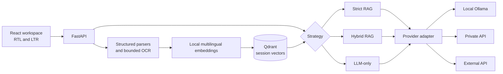

<p align="right"><a href="README.fa.md">فارسی</a> · <strong>English</strong></p>

<p align="center">
  
</p>

<h1 align="center">ParsRAG</h1>

<p align="center">
  <strong>Private document intelligence, designed for Persian.</strong><br>
  Ask traceable questions across Persian and English documents.
</p>

<p align="center">
  <a href="LICENSE"></a>
  
  
  
</p>

ParsRAG is a bilingual, offline-first workspace for document Q&A. Parsing,
OCR, embeddings, and vector search run on the host. Generation can use local
Ollama, a private OpenAI-compatible endpoint, or an external API when local
hardware is unavailable. Every conversation has its own documents, retrieval
scope, answer branches, sources, and deletion lifecycle.

## Highlights

- **Three explicit answer modes:** Strict document-only RAG, Hybrid RAG, and
  model-only chat.
- **Broad ingestion:** PDF, DOCX, PPTX, images, text, Markdown, JSON, CSV, HTML,
  XML, YAML, logs, configuration files, and common source-code formats.
- **OCR where it matters:** scanned PDF pages, standalone images, and images
  embedded in Word or PowerPoint files, with Persian and English Tesseract data.
- **Traceable sources:** unique filenames plus page, slide, paragraph, or
  section locations when the parser can determine them.
- **Local lifecycle:** Qdrant data is isolated by conversation; users can remove
  one document, deselect all documents, or delete an entire session.
- **Adaptive compute:** CPU is the portable default; optional Compose overlays
  accelerate both embeddings and Ollama on NVIDIA or supported AMD hosts.
- **Resource controls:** bounded uploads, OCR dimensions, parser archives,
  concurrency, embedding batches, Qdrant upserts, and container memory.
- **Polished bilingual UI:** RTL/LTR content direction, model settings,
  progressive answers, real processing stages, math rendering, prompt editing,
  retries, and conversation branches.

## Answer modes

| Mode | Retrieval | Model knowledge | Intended use |
| --- | --- | --- | --- |
| **Strict** | Required | Excluded by prompt contract | Answers that must remain grounded in selected documents |
| **Hybrid** | Required and reranked | May supplement evidence | Explanations and synthesis with document priority |
| **LLM-only** | Bypassed | Used directly | General chat unrelated to uploaded documents |

Strict mode refuses when retrieved evidence does not meet its configured
threshold. This is an application safeguard, not a universal guarantee; verify
important outputs against the displayed sources.

## Supported inputs

| Family | Extensions | Processing |
| --- | --- | --- |
| Documents | `.pdf`, `.docx`, `.pptx` | Native structured extraction; OCR for image-only PDF pages and embedded images |
| Images | `.png`, `.jpg`, `.jpeg`, `.webp`, `.bmp`, `.tif`, `.tiff` | Validated and OCR-processed |
| Text and data | `.txt`, `.md`, `.markdown`, `.json`, `.csv`, `.tsv`, `.log` | UTF-8 extraction; JSON is validated and normalized |
| Markup/config | `.html`, `.htm`, `.xml`, `.yaml`, `.yml`, `.toml`, `.ini`, `.cfg` | Visible text or UTF-8 extraction |
| Source code | `.py`, `.js`, `.jsx`, `.ts`, `.tsx`, `.css`, `.sql` | UTF-8 extraction with section metadata |

Default capacity is **10 files per session**, **100 MiB per file**, and **500
MiB per upload batch**. The frontend discovers the effective limits from the
backend, so environment overrides stay synchronized with validation and UI.
Office archives are also checked for entry count, expanded size, and suspicious
compression ratios. Unsupported binary formats are rejected instead of being
silently misread.

## Architecture and trust boundary



| Provider | Generation location | Data leaving ParsRAG |
| --- | --- | --- |
| Local Ollama | This workstation | No prompt or excerpt leaves through the model adapter |
| Private API | A server you control | Prompt and retrieved excerpts in RAG modes |
| External API | A third-party service | Prompt and retrieved excerpts in RAG modes |

Embeddings and Qdrant remain local in all modes. API keys stay in process memory
or environment variables; they are not written to browser storage, logs, API
responses, or the persisted non-secret model configuration.

## Docker quick start

Requirements: Docker Engine with Compose, enough disk space for images and
model weights, and 8–16 GB RAM depending on the selected model.

```powershell
Copy-Item .env.example .env
docker compose config --quiet
```

### Use an API model

Edit `.env`:

```dotenv
LLM_PROVIDER=api
LLM_MODEL_NAME=your-model-id
MODEL_API_BASE_URL=https://provider.example/v1
MODEL_API_KEY=your-runtime-secret
```

Private OpenAI-compatible services can omit the key. Public endpoints require
HTTPS; loopback and private-network endpoints may use HTTP.

```powershell
docker compose up -d --build
```

### Run Ollama on CPU

Choose a model that fits the machine:

```dotenv
LLM_PROVIDER=ollama
LLM_MODEL_NAME=qwen2.5:7b
OLLAMA_MODEL=qwen2.5:7b
```

```powershell
docker compose --profile local-model up -d qdrant ollama
docker compose --profile local-model run --rm ollama-init
docker compose --profile local-model up -d --build app
```

The model is downloaded once into the `ollama_models` volume. CPU inference is
portable but can be slow; smaller quantized models or an API endpoint are often
better on machines without a suitable GPU.

### Run Ollama and embeddings on NVIDIA GPU

Install a current NVIDIA driver and NVIDIA Container Toolkit support in the
Docker host, then use the overlay for every related Compose command:

```powershell
docker compose -f compose.yaml -f compose.gpu.yaml --profile local-model config --quiet
docker compose -f compose.yaml -f compose.gpu.yaml --profile local-model up -d qdrant ollama
docker compose -f compose.yaml -f compose.gpu.yaml --profile local-model run --rm ollama-init
docker compose -f compose.yaml -f compose.gpu.yaml --profile local-model up -d --build app
```

Verify both acceleration paths:

```powershell
docker compose -f compose.yaml -f compose.gpu.yaml exec app python -c "import torch; print(torch.cuda.is_available(), torch.cuda.get_device_name(0))"
docker compose -f compose.yaml -f compose.gpu.yaml exec ollama ollama run qwen2.5:7b "Reply with exactly GPU_OK"
docker compose -f compose.yaml -f compose.gpu.yaml exec ollama ollama ps
```

Cards with about 6 GB VRAM may not hold the embedding model and a 7B generator
at the same time. If `ollama ps` reports CPU/GPU splitting, prioritize generation
on the GPU and keep embeddings on CPU with the low-VRAM overlay:

```powershell
docker compose -f compose.yaml -f compose.gpu.yaml -f compose.gpu-low-vram.yaml --profile local-model up -d app ollama
docker compose -f compose.yaml -f compose.gpu.yaml -f compose.gpu-low-vram.yaml exec ollama ollama ps
```

This also lowers the default Ollama context to 2048 tokens. Override
`OLLAMA_LOW_VRAM_CONTEXT_LENGTH` only when the model and available VRAM can
support a larger context without layer offload. The overlay sets Ollama's free
VRAM fit target to zero; remove the overlay or increase
`OLLAMA_LOW_VRAM_FIT_TARGET` if the desktop needs reserved VRAM.

The app image uses the official PyTorch CUDA 12.4 wheel index. Compose reserves
the NVIDIA device for both `app` and `ollama`. See the official
[Docker Compose GPU guide](https://docs.docker.com/compose/how-tos/gpu-support/),
[Ollama Docker guide](https://github.com/ollama/ollama/blob/main/docs/docker.mdx),
and [Ollama GPU guide](https://github.com/ollama/ollama/blob/main/docs/gpu.mdx)
when preparing a new host.

### Run on supported AMD GPU hosts

The AMD overlay targets Linux ROCm hosts and maps `/dev/kfd` and `/dev/dri`:

```bash
docker compose -f compose.yaml -f compose.amd.yaml --profile local-model config --quiet
docker compose -f compose.yaml -f compose.amd.yaml --profile local-model up -d --build
```

It uses the ROCm Ollama image and PyTorch ROCm 6.2 wheels. Check GPU and driver
compatibility before deployment; unsupported hardware falls back poorly and
should use the CPU profile or an API provider.

Open `http://127.0.0.1:8000` or the port configured by `PARSRAG_PORT`.

```powershell
docker compose ps
docker compose logs -f app
docker compose down
```

`docker compose down` keeps named volumes. `docker compose down -v` permanently
removes local vector data, persisted model settings, caches, and Ollama weights.

## Performance and memory tuning

| Variable | Default | Effect |
| --- | --- | --- |
| `PARSRAG_APP_MEMORY_LIMIT` | `6g` | App container memory ceiling |
| `QDRANT_MEMORY_LIMIT` | `2g` | Qdrant memory ceiling |
| `OLLAMA_MEMORY_LIMIT` | `12g` | Ollama memory ceiling |
| `PARSRAG_CPU_THREADS` | `4` | PyTorch/OpenMP CPU threads |
| `EMBED_DEVICE` | `auto` | Embedding device; GPU overlay sets `cuda` |
| `EMBED_BATCH_SIZE` | `8` | Embedding batch; GPU overlay defaults to `32` |
| `QDRANT_UPSERT_BATCH_SIZE` | `64` | Bounded vector insertion batch |
| `OLLAMA_MAX_LOADED_MODELS` | `1` | Limits concurrently resident models |
| `OLLAMA_NUM_PARALLEL` | `1` | Limits parallel Ollama generations |
| `OLLAMA_KEEP_ALIVE` | `5m` | Duration model weights remain loaded |
| `OLLAMA_CONTEXT_LENGTH` | `4096` | Ollama context; low-VRAM overlay uses `2048` |

Lower batch sizes and concurrency for small-memory machines. Container limits
are ceilings, not reservations; a local model still needs enough RAM or VRAM to
load its weights.

## Upload and OCR configuration

| Variable | Default | Purpose |
| --- | --- | --- |
| `PARSRAG_MAX_FILES_PER_SESSION` | `10` | Total documents in one conversation |
| `PARSRAG_MAX_FILE_BYTES` | `104857600` | 100 MiB per file |
| `PARSRAG_MAX_BATCH_BYTES` | `524288000` | 500 MiB per request batch |
| `PARSRAG_MAX_REQUEST_BYTES` | `534773760` | HTTP body ceiling including multipart overhead |
| `OCR_ENABLED` | `1` | Enable Tesseract paths |
| `OCR_LANGUAGES` | `fas+eng` | OCR language set |
| `OCR_MAX_PAGES` | `30` | Scanned PDF page bound |
| `OCR_MAX_IMAGES` | `30` | Embedded/direct image bound |
| `OCR_MAX_IMAGE_PIXELS` | `40000000` | Decompression-bomb guard per image |
| `OCR_TIMEOUT_SECONDS` | `45` | Per-image/page OCR timeout |

## Native development

Requirements: Python 3.12, Node.js 22, Qdrant, and either Ollama or an
OpenAI-compatible endpoint. Install Tesseract with `fas` and `eng` language data
when OCR is required.

```powershell
py -3.12 -m venv .venv
.\.venv\Scripts\python.exe -m pip install -r requirements-runtime.txt -c requirements.lock

Set-Location frontend
npm ci
npm run build
Set-Location ..

.\.venv\Scripts\python.exe -m uvicorn backend.main:app --host 127.0.0.1 --port 8000
```

For hot reload, run `npm run dev` inside `frontend`. Vite proxies all API route
families to `http://localhost:8000` when the frontend backend URL is blank. Set
`ENVIRONMENT=development` only in a local development `.env` when needed.

## Health, persistence, and offline use

- `/health/live` confirms that the web process is alive.
- `/health/ready` returns `200` after model initialization and Qdrant access;
  `503 {"status":"preparing"}` is expected during first model/cache startup.
- `/capabilities` reports effective upload types and limits to the UI.
- Browser preferences and conversation branches live in `localStorage`.
- Parsed chunks and vectors live in Qdrant under a session identifier.
- Embedding caches, Qdrant data, Ollama models, and non-secret model settings use
  separate named volumes.
- After images and model weights are downloaded once, local Ollama operation can
  remain offline. API-provider mode naturally requires its endpoint.

## Quality gates

```powershell
.\.venv\Scripts\python.exe -m ruff format --check backend
.\.venv\Scripts\python.exe -m ruff check backend
.\.venv\Scripts\python.exe -m mypy backend --strict
.\.venv\Scripts\python.exe -m pytest -q backend/tests

Set-Location frontend
npm test
npm run build
npm run test:e2e
Set-Location ..

docker compose config --quiet
docker compose -f compose.yaml -f compose.gpu.yaml --profile local-model config --quiet
docker compose -f compose.yaml -f compose.gpu.yaml -f compose.gpu-low-vram.yaml --profile local-model config --quiet
docker compose -f compose.yaml -f compose.amd.yaml --profile local-model config --quiet
```

Private fixtures belong in ignored `testData/`; generated experiments and raw
evaluation outputs belong in ignored `scratch/`. Neither directory should be
committed.

## Project documents

- [Persian README](README.fa.md)
- [Visual identity and motion rules](frontend/BRAND.md)
- [Implementation roadmap](.context/05_Implementation_Roadmap.md)
- [Security policy](SECURITY.md)
- [Contribution guide](CONTRIBUTING.md)
- [How to cite ParsRAG](CITATION.cff)
- [Changelog](CHANGELOG.md)

## License

ParsRAG is **source-available, not open source**. The
[ParsRAG Source-Available License](LICENSE) permits downloading and running an
unmodified official release for personal, academic, research, educational, and
internal organizational use. Redistribution, rebranding, hosted-service use,
and unauthorized modifications are prohibited. Changes may be prepared for a
pull request to this repository under the
[Contributor License Agreement](CONTRIBUTOR_LICENSE_AGREEMENT.md). Contact the
copyright holder for any additional permission.
