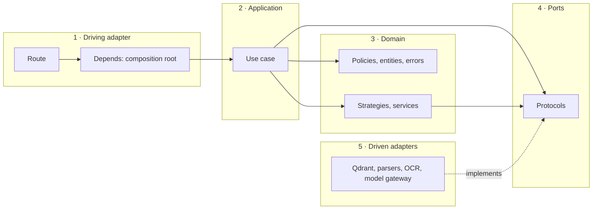
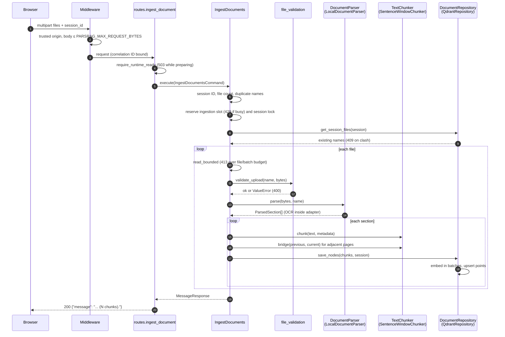
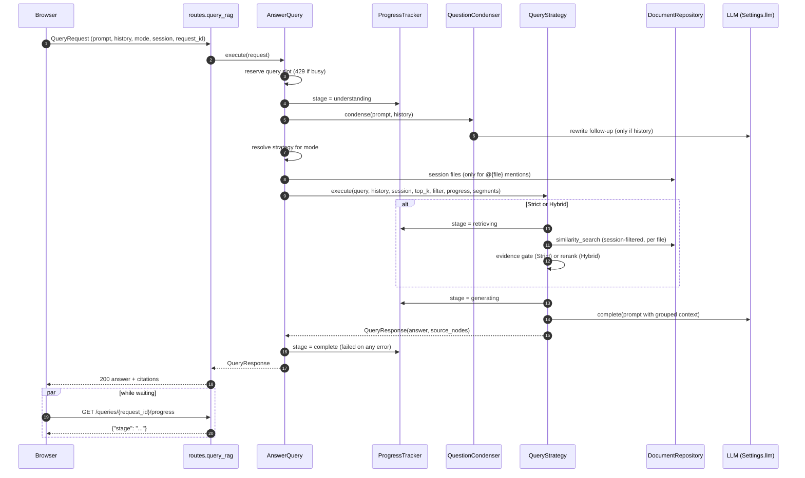
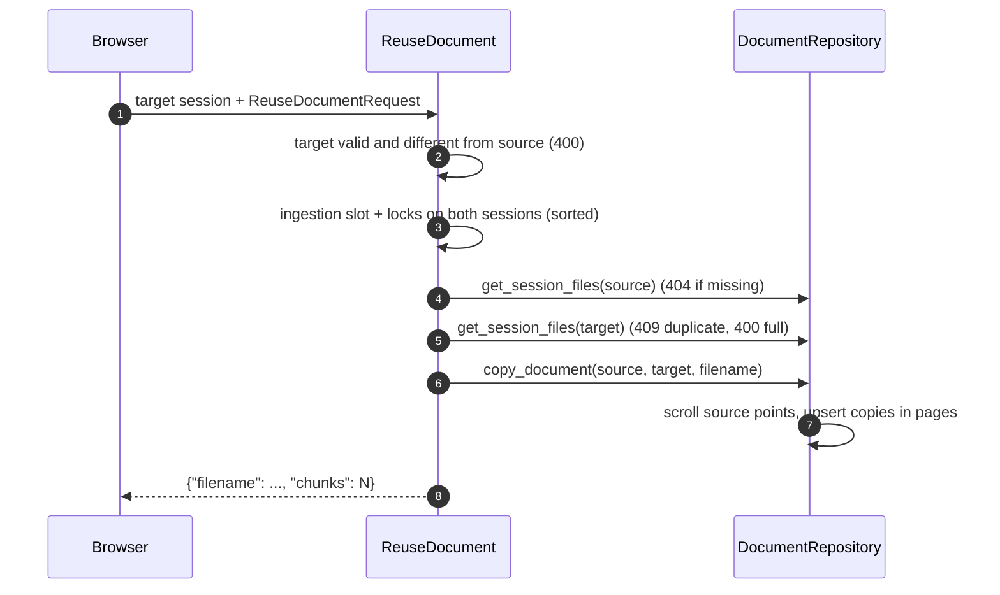
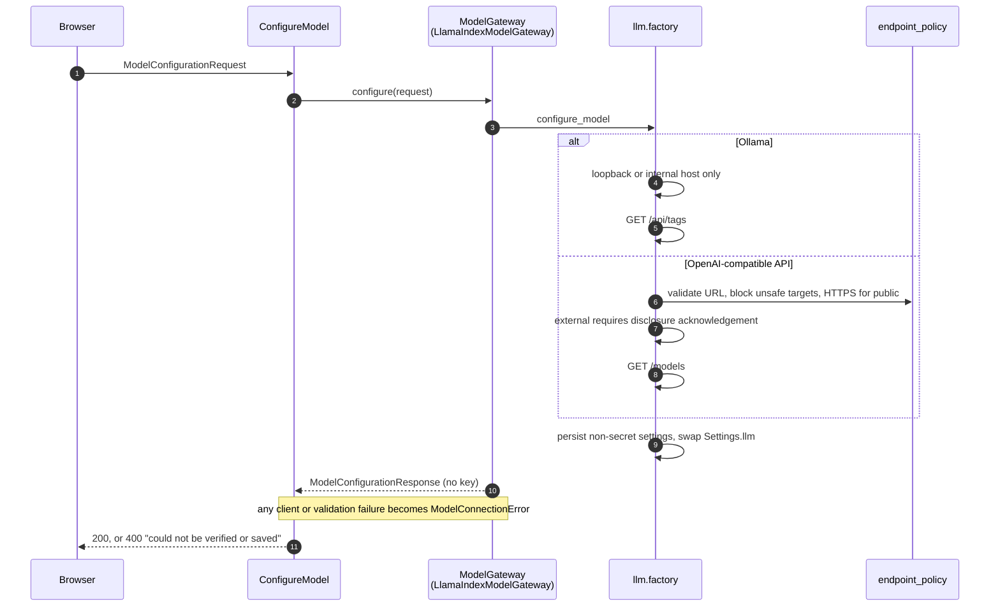
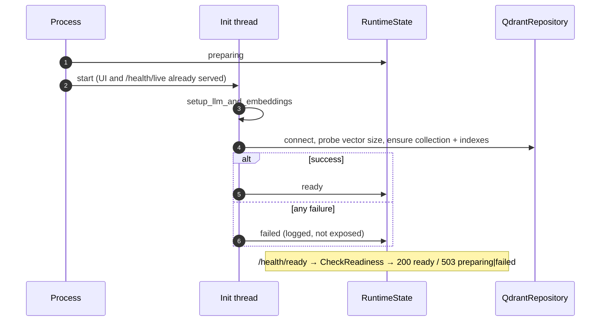

# Blueprint: Data Flow

Layer-by-layer sequences for the main flows. Lanes follow the backend layers
in [ARCHITECTURE.md](../../ARCHITECTURE.md#3-backend-layers): HTTP adapter →
use case → ports → driven adapters. Related blueprints:
[use cases](use-cases.md) and [DTOs](dtos.md).

## Layer map

Data crosses each boundary as a DTO or entity, never as a framework object:
`UploadFile` becomes `IncomingFile`, a request body becomes a validated input
DTO, and Qdrant points become `ExtractedNode` entities.

## Ingestion: `POST /ingest`

## Question answering: `POST /query`

## Document reuse: `POST /sessions/{id}/files/reuse`

## Model configuration: `PUT /models/configuration`

## Startup and readiness

