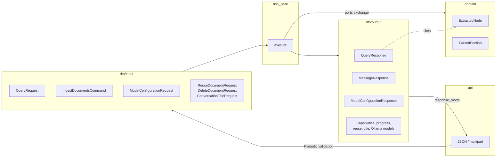

# Blueprint: DTOs

Data transfer objects are split by direction. Inbound DTOs in
`backend/core/dto/input/` validate everything a caller sends; outbound DTOs in
`backend/core/dto/output/` define everything a caller receives. Domain entities
in `backend/core/domain/` are referenced, not copied, when they are part of the
public contract. Related blueprints: [data flow](data-flow.md) and
[use cases](use-cases.md).

## Where DTOs cross layers

## Inbound (`dto/input`)

| DTO | Module | Fields and constraints | Used by |
| --- | --- | --- | --- |
| `QueryRequest` | `query.py` | `prompt` 1–12,000 chars; `chat_history` ≤ 20 `ChatMessage`; `mode` `strict`/`hybrid`/`llm-only` (underscores accepted); `request_id` UUID?; `session_id` ≤ 64 safe chars, required unless LLM-only; `top_k` 1–50?; `file_filter` ≤ 50 names of 1–255 chars? | `AnswerQuery` |
| `ChatMessage` | `query.py` | `role` `user`/`assistant`; `content` 1–12,000 chars | `QueryRequest` |
| `IngestDocumentsCommand` | `ingestion.py` | `session_id`; `files: list[IncomingFile]` | `IngestDocuments` |
| `IncomingFile` | `ingestion.py` | `filename` (may be missing); `stream` read in bounded chunks | `IngestDocumentsCommand` |
| `ReuseDocumentRequest` | `documents.py` | `source_session_id` ≤ 64 safe chars; `filename` 1–255 | `ReuseDocument` |
| `DeleteDocumentRequest` | `documents.py` | `filename` 1–255 | `DeleteDocument` |
| `ModelConfigurationRequest` | `model.py` | `provider` `api`/`ollama`; `model_name` 1–200; `base_url` 1–500; `api_key` ≤ 1,000?; `disclosure_acknowledged` | `ConfigureModel`, model factory, settings store |
| `ConversationTitleRequest` | `model.py` | `prompt` 1–12,000; `language` `fa`/`en` | `GenerateConversationTitle` |

`IngestDocumentsCommand` and `IncomingFile` are frozen dataclasses rather than
Pydantic models because they carry a stream; their rules are enforced by the
use case while reading.

## Outbound (`dto/output`)

| DTO | Module | Fields | Returned by |
| --- | --- | --- | --- |
| `QueryResponse` | `query.py` | `answer`; `source_nodes: list[ExtractedNode]` | `AnswerQuery`, every `QueryStrategy` |
| `QueryProgressResponse` | `query.py` | `stage`: `understanding`, `retrieving`, `generating`, `complete`, `failed` | `ReadQueryProgress` |
| `MessageResponse` | `common.py` | `message` | `IngestDocuments`, `DeleteSession`, `DeleteDocument` |
| `StatusResponse` | `common.py` | `status` | health routes |
| `ReusedDocumentResponse` | `documents.py` | `filename`; `chunks` | `ReuseDocument` |
| `ModelConfigurationResponse` | `model.py` | `provider`; `model_name`; `base_url`; `api_key_configured`; `disclosure_acknowledged` — never the key | model use cases |
| `ConversationTitleResponse` | `model.py` | `title` 1–80 chars | `GenerateConversationTitle` |
| `OllamaModel` | `model.py` | `name`; `size`? | `ListOllamaModels` |
| `AppCapabilitiesResponse` | `capabilities.py` | `ingestion: IngestionCapabilities` (limits, extensions, `ocr_enabled`) | `DescribeCapabilities` |

## Domain entities exchanged through ports

| Entity | Module | Fields | Produced by → consumed by |
| --- | --- | --- | --- |
| `ParsedSection` | `domain/documents.py` | `text`; `metadata` (`page`, `slide`, `paragraph`, `section`) | `DocumentParser` → `IngestDocuments` |
| `ExtractedNode` | `domain/documents.py` | `text`; `metadata` (`filename`, location, `kind`); `score`? | `TextChunker` / `DocumentRepository` → strategies → `QueryResponse` |

## Rules

1. Routes accept and return DTOs only; framework objects stop at the adapter.
2. New fields are optional or defaulted unless the API version changes.
3. Secrets never appear in output DTOs; `api_key_configured` reports presence.
4. Size and count limits live on the DTO (or, for streams, in the use case) so
   they are enforced before any expensive work.
