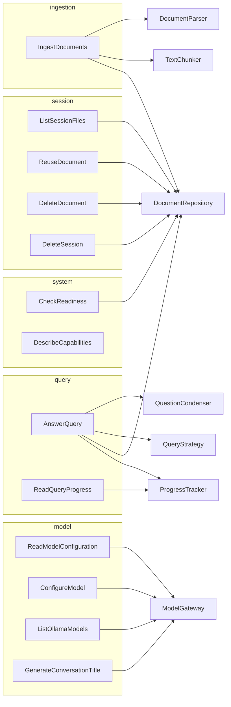

# Blueprint: Use Cases

Every application operation is one class in `backend/core/use_case/<module>/`
with a single `execute` method. Use cases depend only on ports, domain types,
DTOs, and runtime controls; `backend/api/dependencies.py` wires the adapters.
Related blueprints: [data flow](data-flow.md) and [DTOs](dtos.md).

## Module map

## Catalog

| Use case | Route | Input | Output | Ports | Runtime controls |
| --- | --- | --- | --- | --- | --- |
| `IngestDocuments` | `POST /ingest` | `IngestDocumentsCommand` | `IngestResponse` (message + per-file chunks and notices) | `DocumentRepository`, `DocumentParser`, `TextChunker` | ingestion limiter, session lock |
| `AnswerQuery` | `POST /query` | `QueryRequest` | `QueryResponse` | `DocumentRepository`, `QuestionCondenser`, `QueryStrategy`, `ProgressTracker` | query limiter |
| `ReadQueryProgress` | `GET /queries/{id}/progress` | `UUID` | `QueryProgressResponse` | `ProgressTracker` | — |
| `ListSessionFiles` | `GET /sessions/{id}/files` | session ID | `list[str]` | `DocumentRepository` | — |
| `ReuseDocument` | `POST /sessions/{id}/files/reuse` | session ID, `ReuseDocumentRequest` | `ReusedDocumentResponse` | `DocumentRepository` | ingestion limiter, two session locks |
| `DeleteDocument` | `DELETE /sessions/{id}/files` | session ID, `DeleteDocumentRequest` | `MessageResponse` | `DocumentRepository` | session lock |
| `DeleteSession` | `DELETE /sessions/{id}` | session ID | `MessageResponse` | `DocumentRepository` | session lock |
| `ReadModelConfiguration` | `GET /models/configuration` | — | `ModelConfigurationResponse` | `ModelGateway` | — |
| `ConfigureModel` | `PUT /models/configuration` | `ModelConfigurationRequest` | `ModelConfigurationResponse` | `ModelGateway` | — |
| `ListOllamaModels` | `GET /models/ollama` | base URL | `list[OllamaModel]` | `ModelGateway` | — |
| `GenerateConversationTitle` | `POST /conversations/title` | `ConversationTitleRequest` | `ConversationTitleResponse` | `ModelGateway` | query limiter |
| `CheckReadiness` | `GET /health/ready` | — | status string | `DocumentRepository` (lazy) | readiness state |
| `DescribeCapabilities` | `GET /capabilities` | — | `AppCapabilitiesResponse` | — | upload policy |

## Business rules and errors

| Use case | Rule | Error | HTTP |
| --- | --- | --- | --- |
| `IngestDocuments` | Session ID is 1–64 of `[A-Za-z0-9_-]` | `InvalidInputError` | 400 |
| | At least one file; at most `max_files_per_session` per request and per session | `InvalidInputError` | 400 |
| | Names unique within the batch | `InvalidInputError` | 400 |
| | Names not already in the session | `ConflictError` | 409 |
| | File ≤ `max_file_bytes`; batch ≤ `max_batch_bytes`, enforced while reading | `PayloadTooLargeError` | 413 |
| | Content matches extension; Office archives are bounded | `InvalidInputError` | 400 |
| | Document yields text | `EmptyDocumentError` | 400 |
| | One ingestion at a time by default | `CapacityExceededError` | 429 |
| `AnswerQuery` | Document modes require a session (DTO validation) | validation | 422 |
| | `@{file}` mentions must name files in the session and active filter | `InvalidInputError` | 400 |
| | Progress ends in `complete` or `failed` | — | — |
| `ReuseDocument` | Target valid and different from the source | `InvalidInputError` | 400 |
| | Source document exists and copies at least one chunk | `NotFoundError` | 404 |
| | Target lacks the filename and has room | `ConflictError` / `InvalidInputError` | 409 / 400 |
| `ConfigureModel` | Ollama on loopback or the internal host; API URLs safe; external APIs acknowledged; endpoint verified | `InvalidInputError` | 400 |
| `ListOllamaModels` | Ollama reachable at an allowed URL | `UpstreamServiceError` | 502 |
| `ReadQueryProgress` | Stage exists and is younger than 5 minutes | `NotFoundError` | 404 |

## Testing

Each use case is tested in `backend/tests/core/use_case/` with the in-memory
fakes in `fakes.py` (`InMemoryRepository`, `FakeParser`, `FakeChunker`), so
business rules run in milliseconds without FastAPI, Qdrant, or a model. HTTP
contract tests in `backend/tests/api/` cover routing, error mapping, and
middleware.
